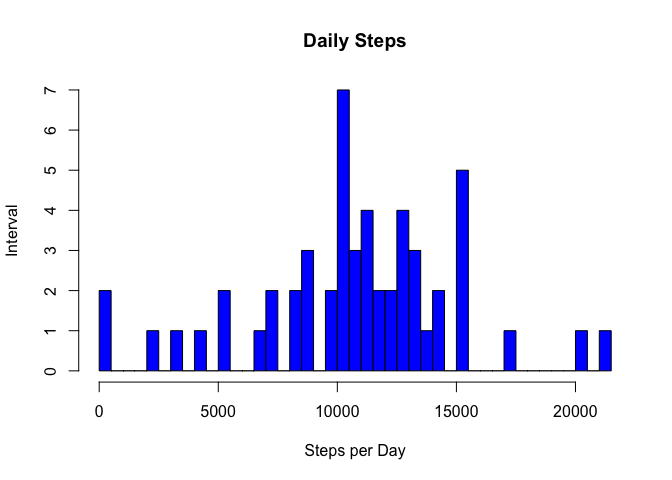
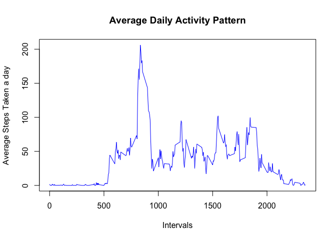
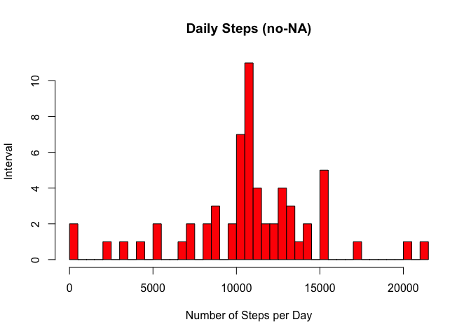
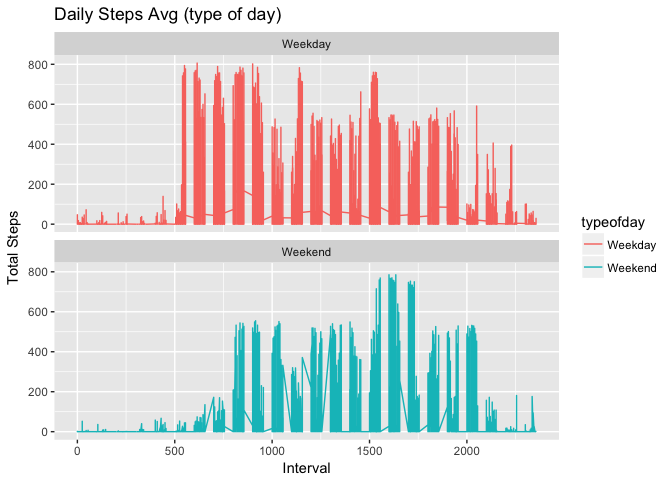

# PA1_Template.Rmd
Chris Brofft  
9/12/2017  
# Reproducible Research: Peer Assessment 1

```r
library(knitr)
library(ggplot2)
library(dplyr)
```

```
## Warning: Installed Rcpp (0.12.12) different from Rcpp used to build dplyr (0.12.11).
## Please reinstall dplyr to avoid random crashes or undefined behavior.
```

```
## 
## Attaching package: 'dplyr'
```

```
## The following objects are masked from 'package:stats':
## 
##     filter, lag
```

```
## The following objects are masked from 'package:base':
## 
##     intersect, setdiff, setequal, union
```

```r
library(plyr)
```

```
## -------------------------------------------------------------------------
```

```
## You have loaded plyr after dplyr - this is likely to cause problems.
## If you need functions from both plyr and dplyr, please load plyr first, then dplyr:
## library(plyr); library(dplyr)
```

```
## -------------------------------------------------------------------------
```

```
## 
## Attaching package: 'plyr'
```

```
## The following objects are masked from 'package:dplyr':
## 
##     arrange, count, desc, failwith, id, mutate, rename, summarise,
##     summarize
```
## Staging the files and setting the directory.  
##The file will be downloaded from the source and unzipped and saved as activity.csv

```r
setwd("~/Rep_Data_Assignment_1")
fileURL <- "https://d396qusza40orc.cloudfront.net/repdata%2Fdata%2Factivity.zip"
downloadFile <- "./repdata%2Fdata%2Factivity.zip"
activityfile <- "./activity.csv"
download.file(fileURL, downloadFile, method = "curl")
unzip(downloadFile, overwrite = T, exdir = "./")
unlink(downloadFile)
```
## Create activity data frame and change date from factor to date type (will be needed later)

```r
activity <-read.csv(activityfile, header=T, sep=",")

activity$date <- as.Date(activity$date, "%Y-%m-%d")
```
# Create data frame with steps by date summed up

```r
dailysteps <- aggregate(steps ~ date, data = activity, FUN = sum, na.rm = TRUE)
```
# Histogram for steps per day

```r
hist(dailysteps$steps, 
     main="Daily Steps", 
     xlab="Steps per Day", 
     ylab = "Interval",
     col = "blue",
     breaks=50)
```

<!-- -->
# Get mean steps

```r
meansteps <- mean(dailysteps$steps)
meansteps
```

```
## [1] 10766.19
```
# Get median steps

```r
mediansteps <- median(dailysteps$steps)
mediansteps
```

```
## [1] 10765
```
# Get daily pattern

```r
dailypattern <- aggregate(steps ~ interval, data = activity, FUN = mean, na.rm = TRUE)
```
#Plot the daily pattern of steps

```r
plot(x = dailypattern$interval, 
     y = dailypattern$steps, 
     type = "l", 
     col = "blue",
     xlab = "Intervals",
     ylab = "Average Steps Taken a day",
     main = "Average Daily Activity Pattern")
```

<!-- -->
# Max steps

```r
maxsteps <- dailypattern$interval[which.max(dailypattern$steps)]
maxsteps
```

```
## [1] 835
```
# Understand missing values

```r
missingvalues <- sum(is.na(activity$steps))
missingvalues
```

```
## [1] 2304
```
# Create activity2 file that excludes Nas

```r
activity2 <- activity
nas <- is.na(activity2$steps)
avg_interval <- tapply(activity2$steps, activity2$interval, mean, na.rm=TRUE, simplify = TRUE)
activity2$steps[nas] <- avg_interval[as.character(activity2$interval[nas])]
sum(is.na(activity2))
```

```
## [1] 0
```

# Daily steps without NAs

```r
dailysteps2 <- aggregate(steps ~ date, data = activity2, FUN = sum, na.rm = TRUE)
dailysteps2
```

```
##          date    steps
## 1  2012-10-01 10766.19
## 2  2012-10-02   126.00
## 3  2012-10-03 11352.00
## 4  2012-10-04 12116.00
## 5  2012-10-05 13294.00
## 6  2012-10-06 15420.00
## 7  2012-10-07 11015.00
## 8  2012-10-08 10766.19
## 9  2012-10-09 12811.00
## 10 2012-10-10  9900.00
## 11 2012-10-11 10304.00
## 12 2012-10-12 17382.00
## 13 2012-10-13 12426.00
## 14 2012-10-14 15098.00
## 15 2012-10-15 10139.00
## 16 2012-10-16 15084.00
## 17 2012-10-17 13452.00
## 18 2012-10-18 10056.00
## 19 2012-10-19 11829.00
## 20 2012-10-20 10395.00
## 21 2012-10-21  8821.00
## 22 2012-10-22 13460.00
## 23 2012-10-23  8918.00
## 24 2012-10-24  8355.00
## 25 2012-10-25  2492.00
## 26 2012-10-26  6778.00
## 27 2012-10-27 10119.00
## 28 2012-10-28 11458.00
## 29 2012-10-29  5018.00
## 30 2012-10-30  9819.00
## 31 2012-10-31 15414.00
## 32 2012-11-01 10766.19
## 33 2012-11-02 10600.00
## 34 2012-11-03 10571.00
## 35 2012-11-04 10766.19
## 36 2012-11-05 10439.00
## 37 2012-11-06  8334.00
## 38 2012-11-07 12883.00
## 39 2012-11-08  3219.00
## 40 2012-11-09 10766.19
## 41 2012-11-10 10766.19
## 42 2012-11-11 12608.00
## 43 2012-11-12 10765.00
## 44 2012-11-13  7336.00
## 45 2012-11-14 10766.19
## 46 2012-11-15    41.00
## 47 2012-11-16  5441.00
## 48 2012-11-17 14339.00
## 49 2012-11-18 15110.00
## 50 2012-11-19  8841.00
## 51 2012-11-20  4472.00
## 52 2012-11-21 12787.00
## 53 2012-11-22 20427.00
## 54 2012-11-23 21194.00
## 55 2012-11-24 14478.00
## 56 2012-11-25 11834.00
## 57 2012-11-26 11162.00
## 58 2012-11-27 13646.00
## 59 2012-11-28 10183.00
## 60 2012-11-29  7047.00
## 61 2012-11-30 10766.19
```
# Histogram that excludes NAs

```r
hist(dailysteps2$steps, 
     main = "Daily Steps (no-NA)", 
     xlab = "Number of Steps per Day", 
     ylab = "Interval",
     col="red",
     breaks=50)
```

<!-- -->
#Compare summaries to see how NAs effect the data points

```r
summary(dailysteps)
```

```
##       date                steps      
##  Min.   :2012-10-02   Min.   :   41  
##  1st Qu.:2012-10-16   1st Qu.: 8841  
##  Median :2012-10-29   Median :10765  
##  Mean   :2012-10-30   Mean   :10766  
##  3rd Qu.:2012-11-16   3rd Qu.:13294  
##  Max.   :2012-11-29   Max.   :21194
```

```r
summary(dailysteps2)
```

```
##       date                steps      
##  Min.   :2012-10-01   Min.   :   41  
##  1st Qu.:2012-10-16   1st Qu.: 9819  
##  Median :2012-10-31   Median :10766  
##  Mean   :2012-10-31   Mean   :10766  
##  3rd Qu.:2012-11-15   3rd Qu.:12811  
##  Max.   :2012-11-30   Max.   :21194
```

```r
head(activity2)
```

```
##       steps       date interval
## 1 1.7169811 2012-10-01        0
## 2 0.3396226 2012-10-01        5
## 3 0.1320755 2012-10-01       10
## 4 0.1509434 2012-10-01       15
## 5 0.0754717 2012-10-01       20
## 6 2.0943396 2012-10-01       25
```
# Break the actvity data into type of days for further analysis

```r
activity2<- activity2%>%
  mutate(typeofday= ifelse(weekdays(activity2$date)=="Saturday" | weekdays(activity2$date)=="Sunday", "Weekend", "Weekday"))
head(activity2)
```

```
##       steps       date interval typeofday
## 1 1.7169811 2012-10-01        0   Weekday
## 2 0.3396226 2012-10-01        5   Weekday
## 3 0.1320755 2012-10-01       10   Weekday
## 4 0.1509434 2012-10-01       15   Weekday
## 5 0.0754717 2012-10-01       20   Weekday
## 6 2.0943396 2012-10-01       25   Weekday
```
# Five minute intervals analysis

```r
fivemin2<- aggregate(steps ~ interval, data = activity2, FUN = mean, na.rm = TRUE)
head(fivemin2)
```

```
##   interval     steps
## 1        0 1.7169811
## 2        5 0.3396226
## 3       10 0.1320755
## 4       15 0.1509434
## 5       20 0.0754717
## 6       25 2.0943396
```
# Plot steps per each type of day

```r
ggplot(activity2, aes(x =interval , y=steps, color=typeofday)) +
  geom_line() +
  labs(title = "Daily Steps Avg (type of day)", x = "Interval", y = "Total Steps") +
  facet_wrap(~ typeofday, ncol = 1, nrow=2)
```

<!-- -->

